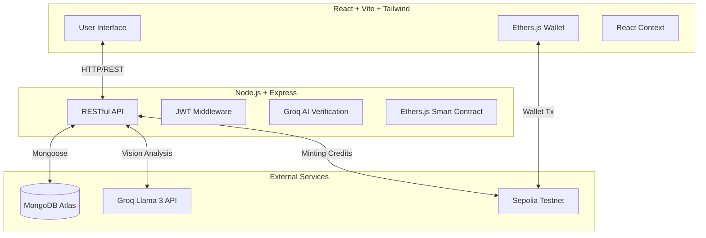

# 🌍 EcoCredit Marketplace

EcoCredit Marketplace is a decentralized platform that incentivizes and monetizes environmental action. Users can perform real-world green actions (such as planting trees, using public transport, or recycling), submit them for **AI-powered verification**, and earn tokenized **Green Credits** on the Ethereum blockchain. These credits can then be traded on our built-in marketplace, creating a sustainable economy driven by positive climate impact.

---

## 🚀 Features

- **AI-Powered Action Verification**: Upload images of your green actions. Our backend uses Groq's high-speed Llama 3 Vision models to analyze the image, verify the action, and automatically estimate the CO₂ offset.
- **Blockchain Integration**: Verified actions are minted as Green Credits on the Ethereum Sepolia Testnet using smart contracts, ensuring transparency and immutability.
- **Decentralized Marketplace**: Users can list their earned Green Credits for sale. Buyers can browse, purchase, and retire credits to offset their own carbon footprints.
- **Interactive Dashboards**: Dedicated dashboards for Users (to track actions and earnings) and Admins (for platform oversight and manual verification fallbacks).
- **Secure Authentication**: Robust JWT-based authentication system with secure password hashing.
- **Modern UI/UX**: Built with React, Tailwind CSS, and shadcn/ui for a highly responsive, beautiful, and accessible user experience.

---

## 🏗️ Architecture

The application is built on a robust, modern MERN-stack architecture augmented with Web3 and AI integrations.



### Tech Stack

| Layer | Technologies |
| --- | --- |
| **Frontend** | React 18, Vite, Tailwind CSS, shadcn/ui, Ethers.js, Lucide Icons |
| **Backend** | Node.js, Express, Mongoose, JSON Web Tokens (JWT), Cors |
| **Database** | MongoDB Atlas |
| **AI Processing** | Groq SDK (Llama 3.2 Vision Preview, Llama 3.3 Versatile) |
| **Blockchain** | Ethereum (Sepolia Testnet), Ethers.js |

---

## 🛠️ Getting Started

Follow these instructions to get a copy of the project up and running on your local machine for development and testing purposes.

### Prerequisites
- Node.js (v18 or higher)
- MongoDB Database (Local or Atlas URI)
- Groq API Key
- Ethereum Wallet (e.g., MetaMask) on Sepolia Testnet

### Installation

1. **Clone the repository**
   ```bash
   git clone https://github.com/panyakapoor1/EcoCredit-Marketplace.git
   cd EcoCredit-Marketplace
   ```

2. **Install Frontend Dependencies**
   ```bash
   npm install
   ```

3. **Install Backend Dependencies**
   ```bash
   cd server
   npm install
   ```

### Configuration

1. **Backend Environment Variables**
   Create a `.env` file in the `server/` directory:
   ```env
   PORT=5000
   MONGO_URI=your_mongodb_connection_string
   JWT_SECRET=your_super_secret_jwt_key
   GROQ_API_KEY=your_groq_api_key
   RPC_URL=your_sepolia_rpc_url
   PRIVATE_KEY=your_wallet_private_key
   CONTRACT_ADDRESS=your_deployed_contract_address
   ```

2. **Frontend Environment Variables**
   Create a `.env` file in the root directory:
   ```env
   VITE_API_URL=http://localhost:5000/api
   ```

### Running the Application

1. **Start the Backend Server**
   ```bash
   cd server
   npm run dev
   ```

2. **Start the Frontend Development Server**
   ```bash
   # From the root directory
   npm run dev
   ```

3. Open your browser and navigate to `http://localhost:5173`

---

## 📖 How It Works

1. **Perform a Green Action**: Take public transit, plant a tree, or install solar panels.
2. **Submit for Verification**: Fill out the form on the platform and upload photographic evidence.
3. **AI Analysis**: The backend forwards your image to Groq's Vision AI, which verifies the legitimacy of the action and assigns a credit score based on the estimated CO₂ offset.
4. **Minting**: Upon successful verification, a smart contract interaction mints Green Credits to your registered wallet address.
5. **Trading**: Navigate to the marketplace to list your credits. Buyers can purchase them directly through the platform.

---

## 🤝 Contributing
Contributions, issues, and feature requests are welcome! Feel free to check the [issues page](https://github.com/panyakapoor1/EcoCredit-Marketplace/issues).

## 🤝 Project Team - The Chainmakers
Team Members - Panya Kapoor, Tanisha Bhargava & Aditya Raj Singh

## 📝 License
This project is licensed under the MIT License.
